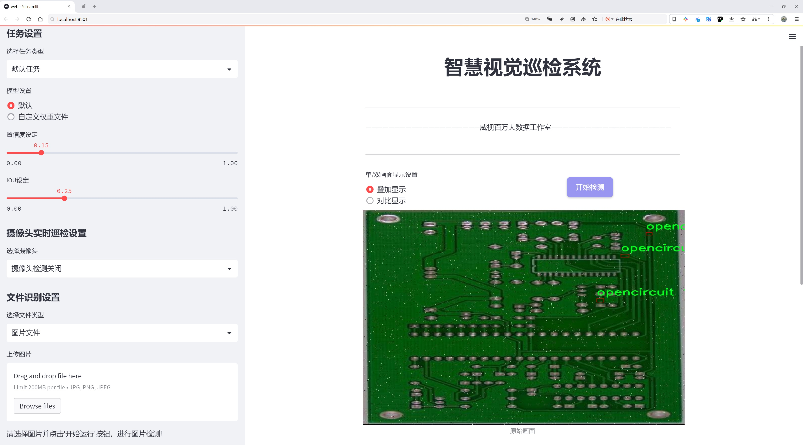
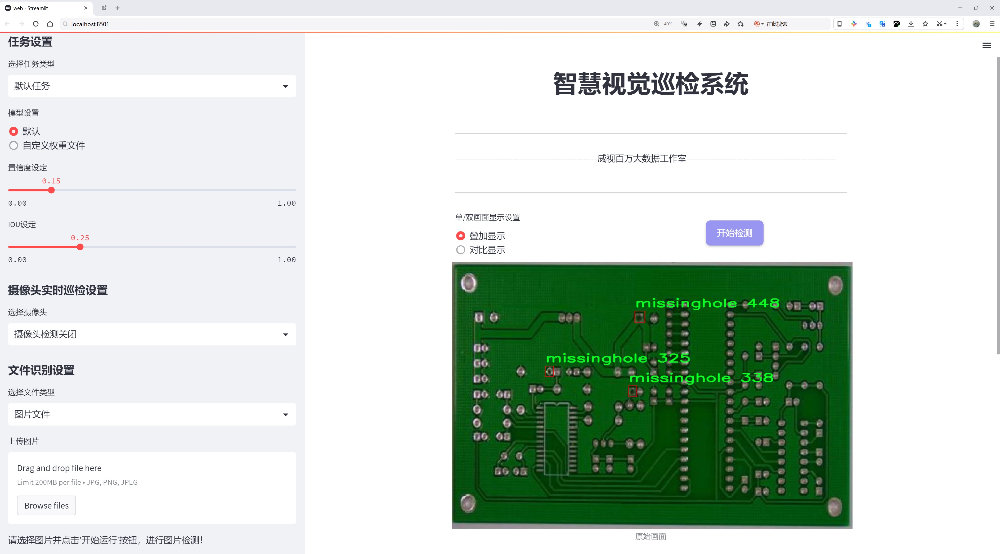
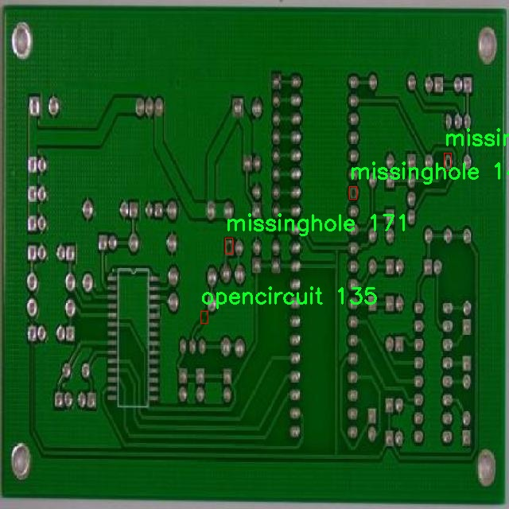
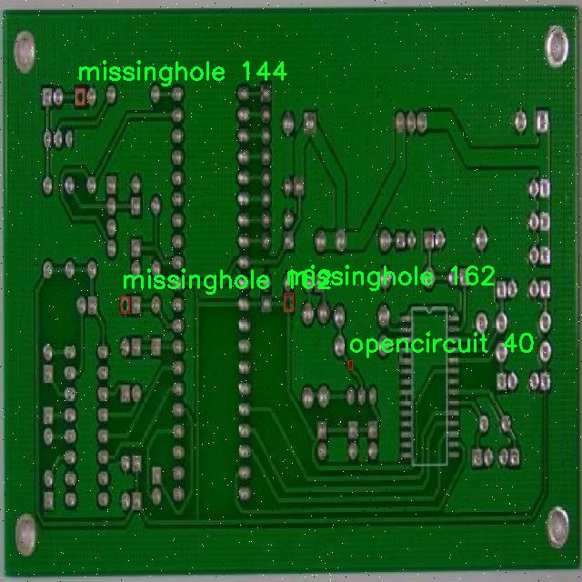
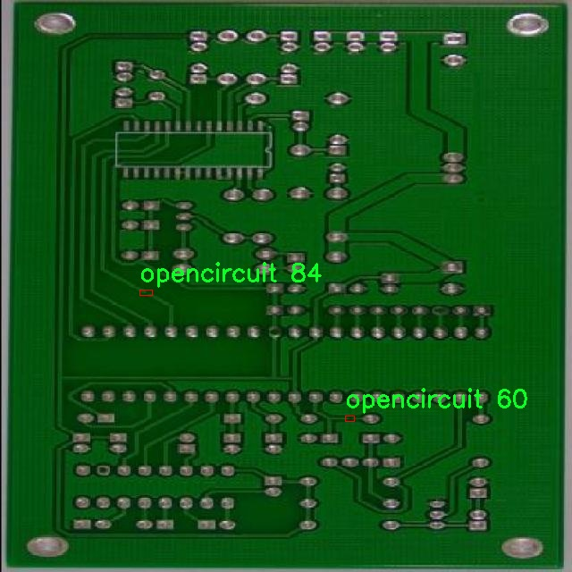
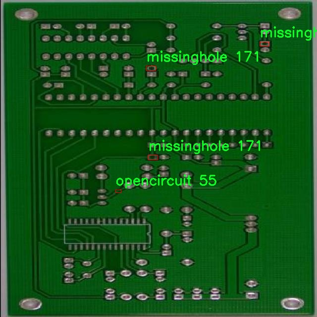
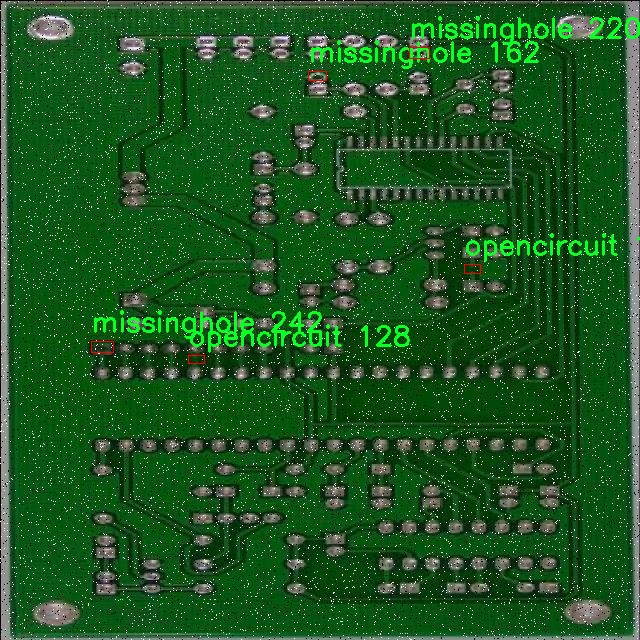

# 电路板缺陷检测系统源码分享
 # [一条龙教学YOLOV8标注好的数据集一键训练_70+全套改进创新点发刊_Web前端展示]

### 1.研究背景与意义

项目参考[AAAI Association for the Advancement of Artificial Intelligence](https://gitee.com/qunmasj/projects)

研究背景与意义

随着电子技术的迅猛发展，电路板作为电子设备的核心组成部分，其质量直接影响到设备的性能和可靠性。电路板的缺陷检测因此成为了电子制造行业中的一个重要环节。传统的缺陷检测方法主要依赖人工视觉检查和简单的图像处理技术，这些方法不仅效率低下，而且容易受到人为因素的影响，导致漏检和误检的情况频繁发生。为了提高检测的准确性和效率，越来越多的研究者开始探索基于深度学习的自动化检测技术。

YOLO（You Only Look Once）系列模型因其高效的实时目标检测能力而受到广泛关注。特别是YOLOv8作为该系列的最新版本，结合了更先进的网络结构和优化算法，能够在保持高精度的同时实现快速的检测速度。然而，尽管YOLOv8在一般目标检测任务中表现出色，但在特定领域如电路板缺陷检测中，仍然面临着一些挑战。这些挑战主要体现在缺陷种类的多样性、缺陷特征的微小差异以及复杂背景对检测结果的影响等方面。因此，针对电路板缺陷检测的特定需求，对YOLOv8进行改进和优化显得尤为重要。

本研究旨在基于改进的YOLOv8模型，构建一个高效的电路板缺陷检测系统。我们将使用一个包含9761张图像的电路板缺陷数据集，该数据集涵盖了8种不同类型的缺陷，包括假铜、缺孔、鼠咬、开路、针孔、划痕、短路和多余铜等。这些缺陷的多样性和复杂性为模型的训练和评估提供了丰富的素材，同时也为我们在模型改进过程中提供了实际的挑战。

通过对YOLOv8模型的改进，我们将探索如何更好地提取电路板缺陷的特征，增强模型对微小缺陷的识别能力。此外，我们还将研究如何通过数据增强、迁移学习等技术，提高模型在不同电路板样本上的泛化能力。最终目标是实现一个高效、准确的电路板缺陷检测系统，以满足现代电子制造业对自动化检测的迫切需求。

本研究的意义不仅在于提升电路板缺陷检测的技术水平，更在于推动电子制造行业的智能化发展。通过引入先进的深度学习技术，我们期望能够显著降低人工检测的成本，提高生产效率，减少因缺陷导致的产品返工和报废率，从而为企业创造更大的经济效益。此外，随着智能制造的不断发展，基于深度学习的检测系统也将为其他领域的自动化检测提供借鉴和参考，具有广泛的应用前景。

综上所述，基于改进YOLOv8的电路板缺陷检测系统的研究，不仅具有重要的理论价值，也具备显著的实际应用意义。通过深入探索和创新，我们希望能够为电路板缺陷检测领域带来新的突破，推动行业的技术进步与发展。

### 2.图片演示






##### 注意：由于此博客编辑较早，上面“2.图片演示”和“3.视频演示”展示的系统图片或者视频可能为老版本，新版本在老版本的基础上升级如下：（实际效果以升级的新版本为准）

  （1）适配了YOLOV8的“目标检测”模型和“实例分割”模型，通过加载相应的权重（.pt）文件即可自适应加载模型。

  （2）支持“图片识别”、“视频识别”、“摄像头实时识别”三种识别模式。

  （3）支持“图片识别”、“视频识别”、“摄像头实时识别”三种识别结果保存导出，解决手动导出（容易卡顿出现爆内存）存在的问题，识别完自动保存结果并导出到。

  （4）支持Web前端系统中的标题、背景图等自定义修改，后面提供修改教程。

  另外本项目提供训练的数据集和训练教程,暂不提供权重文件（best.pt）,需要您按照教程进行训练后实现图片演示和Web前端界面演示的效果。

### 3.视频演示

[3.1 视频演示](https://www.bilibili.com/video/BV1JxsFepEnP/?vd_source=ff015de2d29cbe2a9cdbfa7064407a08)

### 4.数据集信息展示

数据集信息展示

在现代电子制造行业中，电路板的质量控制至关重要。为了提升电路板缺陷检测的准确性和效率，我们开发了一个名为PCBYOLO8的数据集，专门用于训练改进版的YOLOv8模型。该数据集包含9761张高质量的图像，涵盖了电路板上常见的八种缺陷类别。这些类别包括：假铜（falsecopper）、缺孔（missinghole）、鼠咬（mousebite）、开路（opencircuit）、针孔（pinhole）、划痕（scratch）、短路（shortcircuit）和多余的电路（spur）。每一类缺陷都代表了电路板在生产过程中可能出现的特定问题，这些问题不仅影响产品的性能，还可能导致严重的安全隐患。

数据集中的图像经过精心挑选和标注，确保每个缺陷的特征都能被清晰地识别。假铜缺陷通常表现为表面不规则的铜层，而缺孔则是指电路板上预留的孔未能按要求加工。鼠咬缺陷则是指在电路板上出现的微小缺口，通常是由于机械加工不当造成的。开路缺陷则是电路板中某些线路未能连接，导致电流无法正常流通。针孔缺陷通常是由于生产过程中出现的微小气泡，而划痕则是指电路板表面由于碰撞或摩擦而产生的可见痕迹。短路缺陷则是指电路板上两个不应连接的导电部分意外接触，最后，多余的电路则是指在设计中未被使用的多余导线。

该数据集的设计不仅考虑到了缺陷的多样性，还确保了图像的多样性，包括不同的拍摄角度、光照条件和背景。这种多样性使得训练出的YOLOv8模型能够在各种实际应用场景中表现出色，具备较强的泛化能力。此外，数据集的标注遵循了严格的标准，确保每个缺陷都能被准确识别，从而提高了模型的检测精度。

PCBYOLO8数据集的使用许可为CC BY 4.0，这意味着研究人员和开发者可以自由使用、修改和分发该数据集，只需在使用时给予适当的署名。这种开放的许可方式促进了学术界和工业界的合作，推动了电路板缺陷检测技术的进步。

通过使用PCBYOLO8数据集，研究人员能够有效地训练和评估改进版YOLOv8模型，以实现更高效的电路板缺陷检测。这不仅能够提高生产效率，降低人工检测的成本，还能大幅提升电路板的整体质量，为电子产品的可靠性提供保障。随着技术的不断进步，未来的电路板缺陷检测将更加智能化和自动化，为电子制造行业带来更大的变革。











### 5.全套项目环境部署视频教程（零基础手把手教学）

[5.1 环境部署教程链接（零基础手把手教学）](https://www.ixigua.com/7404473917358506534?logTag=c807d0cbc21c0ef59de5)


[5.2 安装Python虚拟环境创建和依赖库安装视频教程链接（零基础手把手教学）](https://www.ixigua.com/7404474678003106304?logTag=1f1041108cd1f708b01a)

### 6.手把手YOLOV8训练视频教程（零基础小白有手就能学会）

[6.1 环境部署教程链接（零基础手把手教学）](https://www.ixigua.com/7404477157818401292?logTag=d31a2dfd1983c9668658)

### 7.70+种全套YOLOV8创新点代码加载调参视频教程（一键加载写好的改进模型的配置文件）

[7.1 环境部署教程链接（零基础手把手教学）](https://www.ixigua.com/7404478314661806627?logTag=29066f8288e3f4eea3a4)

### 8.70+种全套YOLOV8创新点原理讲解（非科班也可以轻松写刊发刊，V10版本正在科研待更新）

由于篇幅限制，每个创新点的具体原理讲解就不一一展开，具体见下列网址中的创新点对应子项目的技术原理博客网址【Blog】：


[8.1 70+种全套YOLOV8创新点原理讲解链接](https://gitee.com/qunmasj/good)

### 9.系统功能展示（检测对象为举例，实际内容以本项目数据集为准）

图1.系统支持检测结果表格显示

  图2.系统支持置信度和IOU阈值手动调节

  图3.系统支持自定义加载权重文件best.pt(需要你通过步骤5中训练获得)

  图4.系统支持摄像头实时识别

  图5.系统支持图片识别

  图6.系统支持视频识别

  图7.系统支持识别结果文件自动保存

  图8.系统支持Excel导出检测结果数据


### 10.原始YOLOV8算法原理

原始YOLOv8算法原理

YOLOv8是由Ultralytics公司于2023年推出的最新目标检测算法，作为YOLO系列的延续，YOLOv8在多个方面进行了创新和改进，尤其是在模型结构、特征提取和损失函数的设计上。该算法不仅在准确性上有显著提升，还在计算效率和实时性方面表现出色，适用于各种实际应用场景。

YOLOv8的网络结构由输入层、主干网络、颈部网络和头部网络四个主要组件构成。输入层负责将原始图像缩放到指定的输入尺寸，以便后续处理。主干网络的设计采用了CSP（Cross Stage Partial）结构，通过将特征提取过程分为两个部分来增强模型的表达能力。在这一过程中，YOLOv8使用了C2f模块替代了YOLOv5中的C3模块。C2f模块的设计灵感来源于YOLOv7中的E-ELAN结构，通过引入更多的分支连接，C2f模块能够有效地改善梯度流动，从而提升特征提取的效果。这种设计不仅丰富了网络的结构，还增强了模型在特征学习过程中的灵活性。

在主干网络的末尾，YOLOv8引入了SPPF（Spatial Pyramid Pooling Fast）模块，该模块通过三个最大池化层处理多尺度特征，进一步增强了网络的特征抽象能力。SPPF模块的引入使得YOLOv8能够更好地处理不同尺度的目标，提高了对小目标的检测能力。接下来，颈部网络采用了FPN（Feature Pyramid Network）和PAN（Path Aggregation Network）结构的结合，旨在实现多尺度特征的有效融合。FPN结构通过自上而下的特征传递，能够将高层语义信息与低层细节信息结合起来，而PAN结构则通过自下而上的路径聚合，进一步提升了特征的表达能力。这种设计使得YOLOv8在处理复杂场景时，能够更好地捕捉到目标的多样性和复杂性。

YOLOv8在检测网络的设计上采取了Anchor-Free的检测方式，避免了传统Anchor-based方法中的一些局限性。通过解耦头结构，YOLOv8的Detect模块能够分别处理类别和位置的回归任务，极大地提高了模型的灵活性和准确性。解耦头的设计使得每个任务都可以独立优化，从而在训练过程中更好地聚焦于不同的目标特征。这种结构的优势在于能够减少任务之间的干扰，提高模型的整体性能。

在损失函数的设计上，YOLOv8采用了CloU（Complete Intersection over Union）作为回归损失，同时引入了Varifocal Loss（VFL）作为分类损失。CloU损失函数在传统IoU的基础上进行了改进，能够更好地处理目标框的重叠情况，提高了定位精度。而Varifocal Loss则通过不对称参数对正负样本进行加权，使得模型在训练时能够更加关注高质量的正样本，从而提升检测精度。具体而言，VFL通过对负样本的衰减处理，降低了负样本对损失的贡献，使得模型在训练过程中能够更有效地学习到有用的特征。

在数据预处理方面，YOLOv8延续了YOLOv5的策略，采用了多种数据增强技术，如马赛克增强、混合增强、空间扰动和颜色扰动等。这些增强手段不仅丰富了训练数据的多样性，还有效提升了模型的鲁棒性，使得YOLOv8在面对不同场景和光照条件时，依然能够保持良好的检测性能。

总的来说，YOLOv8通过一系列创新的设计和改进，不仅提升了目标检测的准确性和效率，还在模型的灵活性和适应性方面做出了重要贡献。其独特的网络结构和损失函数设计，使得YOLOv8在实际应用中表现出色，能够满足不同场景下的目标检测需求。随着YOLOv8的推出，目标检测技术将迎来新的发展机遇，为智能监控、自动驾驶、无人机等领域的应用提供了更为强大的技术支持。


### 11.项目核心源码讲解（再也不用担心看不懂代码逻辑）

#### 11.1 ui.py

以下是经过精简和注释的核心代码：

```python
import sys
import subprocess
from QtFusion.path import abs_path

def run_script(script_path):
    """
    使用当前 Python 环境运行指定的脚本。

    Args:
        script_path (str): 要运行的脚本路径
    """
    # 获取当前 Python 解释器的路径
    python_path = sys.executable

    # 构建运行命令，使用 streamlit 运行指定的脚本
    command = f'"{python_path}" -m streamlit run "{script_path}"'

    # 执行命令并等待其完成
    result = subprocess.run(command, shell=True)
    
    # 检查命令执行结果，如果返回码不为0，则表示出错
    if result.returncode != 0:
        print("脚本运行出错。")

# 主程序入口
if __name__ == "__main__":
    # 获取要运行的脚本的绝对路径
    script_path = abs_path("web.py")

    # 调用函数运行脚本
    run_script(script_path)
```

### 代码分析与注释：
1. **导入模块**：
   - `sys`：用于访问与 Python 解释器相关的变量和函数。
   - `subprocess`：用于执行外部命令。
   - `abs_path`：从 `QtFusion.path` 导入的函数，用于获取文件的绝对路径。

2. **`run_script` 函数**：
   - 该函数接收一个脚本路径作为参数，并使用当前 Python 环境运行该脚本。
   - 使用 `sys.executable` 获取当前 Python 解释器的路径，以确保脚本在正确的环境中运行。
   - 构建一个命令字符串，使用 `streamlit` 模块运行指定的脚本。
   - 使用 `subprocess.run` 执行命令，并等待其完成。
   - 检查返回码，如果不为0，表示脚本运行出错，并打印错误信息。

3. **主程序入口**：
   - 使用 `if __name__ == "__main__":` 确保该代码块仅在直接运行脚本时执行。
   - 获取要运行的脚本 `web.py` 的绝对路径。
   - 调用 `run_script` 函数，传入脚本路径以执行该脚本。

这个文件是一个 Python 脚本，主要用于运行另一个名为 `web.py` 的脚本。它首先导入了一些必要的模块，包括 `sys`、`os` 和 `subprocess`，这些模块提供了与系统交互的功能。特别是 `subprocess` 模块用于在新的进程中执行命令。

在脚本中定义了一个名为 `run_script` 的函数，该函数接受一个参数 `script_path`，表示要运行的脚本的路径。函数内部首先获取当前 Python 解释器的路径，这通过 `sys.executable` 实现。接着，构建一个命令字符串，使用 `streamlit` 运行指定的脚本。`streamlit` 是一个用于构建数据应用的库，这里通过 `-m` 参数指定以模块的方式运行。

随后，使用 `subprocess.run` 方法执行构建好的命令。如果命令执行后返回的状态码不为零，表示脚本运行出错，程序会输出相应的错误信息。

在脚本的最后部分，使用 `if __name__ == "__main__":` 来确保只有在直接运行该脚本时才会执行以下代码。这部分代码指定了要运行的脚本路径，调用 `abs_path` 函数来获取 `web.py` 的绝对路径，并最终调用 `run_script` 函数来执行这个脚本。

总的来说，这个文件的功能是方便地启动一个基于 Streamlit 的 web 应用，通过调用另一个 Python 脚本来实现。

#### 11.2 ultralytics\models\yolo\pose\__init__.py

以下是代码中最核心的部分，并附上详细的中文注释：

```python
# 导入所需的模块
from .predict import PosePredictor  # 导入姿态预测器
from .train import PoseTrainer      # 导入姿态训练器
from .val import PoseValidator       # 导入姿态验证器

# 定义模块的公开接口
__all__ = "PoseTrainer", "PoseValidator", "PosePredictor"  # 指定可被外部访问的类或函数
```

### 注释说明：
1. **导入模块**：
   - `from .predict import PosePredictor`：从当前包中导入 `PosePredictor` 类，用于姿态预测。
   - `from .train import PoseTrainer`：从当前包中导入 `PoseTrainer` 类，用于训练模型。
   - `from .val import PoseValidator`：从当前包中导入 `PoseValidator` 类，用于验证模型的性能。

2. **定义公开接口**：
   - `__all__` 是一个特殊变量，用于定义当使用 `from module import *` 时，哪些类或函数是可以被导入的。在这里，指定了 `PoseTrainer`、`PoseValidator` 和 `PosePredictor` 三个类可以被外部访问。

这个程序文件是Ultralytics YOLO项目中的一个模块，主要用于姿态估计（Pose Estimation）。文件名为`__init__.py`，它的主要作用是将当前目录标识为一个Python包，并且可以在导入时定义该包的公共接口。

文件开头的注释部分表明该项目遵循AGPL-3.0许可证，并且是Ultralytics YOLO的一部分，YOLO是一种流行的目标检测和姿态估计算法。

接下来，文件通过`from`语句导入了三个类：`PosePredictor`、`PoseTrainer`和`PoseValidator`。这些类分别用于姿态预测、训练和验证。在姿态估计的工作流程中，`PoseTrainer`负责模型的训练，`PoseValidator`用于评估模型的性能，而`PosePredictor`则用于实际的姿态预测任务。

最后，`__all__`变量定义了该模块的公共接口，列出了可以通过`from module import *`语句导入的名称。在这里，`__all__`包含了三个类的名称，确保在使用通配符导入时，只有这些类会被导入，从而避免不必要的名称冲突。

总体来说，这个文件是一个简单而重要的模块初始化文件，它为姿态估计相关的功能提供了一个清晰的接口。

#### 11.3 ultralytics\models\yolo\obb\predict.py

以下是代码中最核心的部分，并附上详细的中文注释：

```python
import torch
from ultralytics.engine.results import Results
from ultralytics.models.yolo.detect.predict import DetectionPredictor
from ultralytics.utils import ops

class OBBPredictor(DetectionPredictor):
    """
    OBBPredictor类，扩展了DetectionPredictor类，用于基于定向边界框（OBB）模型的预测。
    """

    def __init__(self, cfg=DEFAULT_CFG, overrides=None, _callbacks=None):
        """初始化OBBPredictor，支持模型和数据配置的可选覆盖。"""
        super().__init__(cfg, overrides, _callbacks)  # 调用父类的初始化方法
        self.args.task = "obb"  # 设置任务类型为"obb"

    def postprocess(self, preds, img, orig_imgs):
        """后处理预测结果，并返回Results对象的列表。"""
        # 使用非极大值抑制（NMS）来过滤预测框
        preds = ops.non_max_suppression(
            preds,
            self.args.conf,  # 置信度阈值
            self.args.iou,  # IOU阈值
            agnostic=self.args.agnostic_nms,  # 是否使用类别无关的NMS
            max_det=self.args.max_det,  # 最大检测框数量
            nc=len(self.model.names),  # 类别数量
            classes=self.args.classes,  # 需要检测的类别
            rotated=True,  # 指定为旋转框
        )

        # 如果输入图像不是列表，则将其转换为numpy数组
        if not isinstance(orig_imgs, list):
            orig_imgs = ops.convert_torch2numpy_batch(orig_imgs)

        results = []  # 初始化结果列表
        # 遍历每个预测结果、原始图像和图像路径
        for pred, orig_img, img_path in zip(preds, orig_imgs, self.batch[0]):
            # 将预测框的坐标从当前图像的大小缩放到原始图像的大小
            pred[:, :4] = ops.scale_boxes(img.shape[2:], pred[:, :4], orig_img.shape, xywh=True)
            # 将预测框的坐标、置信度和类别信息合并为OBB格式
            obb = torch.cat([pred[:, :4], pred[:, -1:], pred[:, 4:6]], dim=-1)
            # 创建Results对象并添加到结果列表中
            results.append(Results(orig_img, path=img_path, names=self.model.names, obb=obb))
        return results  # 返回结果列表
```

### 代码核心部分说明：
1. **类定义**：`OBBPredictor` 继承自 `DetectionPredictor`，用于处理定向边界框的预测。
2. **初始化方法**：`__init__` 方法设置了任务类型为 "obb"，并调用父类的初始化方法。
3. **后处理方法**：`postprocess` 方法对模型的预测结果进行后处理，包括：
   - 使用非极大值抑制（NMS）来过滤冗余的预测框。
   - 将预测框的坐标从当前图像的大小缩放到原始图像的大小。
   - 将预测框的相关信息（坐标、置信度、类别）合并为OBB格式，并返回结果列表。

这个程序文件是Ultralytics YOLO模型的一部分，专门用于基于定向边界框（Oriented Bounding Box，OBB）进行目标检测的预测。文件中定义了一个名为`OBBPredictor`的类，它继承自`DetectionPredictor`类，扩展了其功能以支持OBB模型的预测。

在文件的开头，导入了必要的库和模块，包括`torch`和一些Ultralytics框架中的工具类和函数。`Results`类用于存储预测结果，`DetectionPredictor`类是进行目标检测的基础类，而`ops`模块则包含了一些常用的操作函数。

`OBBPredictor`类的构造函数`__init__`接受三个参数：`cfg`（配置），`overrides`（覆盖配置），和`_callbacks`（回调函数）。在构造函数中，调用了父类的构造函数，并将任务类型设置为“obb”，表明该预测器将处理定向边界框的任务。

`postprocess`方法用于对模型的预测结果进行后处理。首先，它调用`ops.non_max_suppression`函数，对预测结果进行非极大值抑制，以消除冗余的边界框。这个函数根据置信度和IoU（交并比）等参数过滤掉低质量的检测结果。

接下来，方法检查输入的原始图像是否为列表，如果不是，则将其转换为NumPy数组。然后，方法遍历每个预测结果、原始图像和图像路径，使用`ops.scale_boxes`函数将预测的边界框坐标从当前图像的尺度转换为原始图像的尺度。最终，将处理后的边界框、置信度和类别信息组合成一个OBB格式的张量，并将其与原始图像和路径一起存储在`Results`对象中。

最后，`postprocess`方法返回一个包含所有预测结果的列表。这个类的设计使得用户可以方便地使用YOLO模型进行定向边界框的目标检测，并获取详细的预测结果。通过示例代码，用户可以看到如何初始化`OBBPredictor`并使用其进行预测。

#### 11.4 ultralytics\engine\__init__.py

以下是对代码的核心部分进行提炼和详细注释的结果：

```python
# Ultralytics YOLO 🚀, AGPL-3.0 license

# 该代码是Ultralytics YOLO（You Only Look Once）模型的实现部分。
# YOLO是一种实时目标检测系统，能够在图像中快速识别和定位多个对象。

# YOLO的工作流程通常包括以下几个步骤：
# 1. 输入图像：将待检测的图像输入到模型中。
# 2. 特征提取：通过卷积神经网络（CNN）提取图像特征。
# 3. 预测边界框：模型会为每个可能的对象预测一个边界框及其置信度。
# 4. 分类：模型会对每个边界框内的对象进行分类。
# 5. 非极大值抑制：去除重叠的边界框，保留最有可能的检测结果。

# YOLO模型的优点在于其速度快、精度高，适合实时应用场景。

# 下面是YOLO模型的核心部分示例（伪代码）：

class YOLO:
    def __init__(self, model_path):
        # 初始化YOLO模型，加载预训练的权重
        self.model = self.load_model(model_path)

    def load_model(self, model_path):
        # 加载模型权重的函数
        pass  # 具体实现省略

    def predict(self, image):
        # 对输入图像进行目标检测
        features = self.extract_features(image)  # 提取特征
        boxes, scores, classes = self.detect_objects(features)  # 检测对象
        return self.non_max_suppression(boxes, scores, classes)  # 应用非极大值抑制

    def extract_features(self, image):
        # 提取图像特征的函数
        pass  # 具体实现省略

    def detect_objects(self, features):
        # 检测对象的函数，返回边界框、置信度和类别
        pass  # 具体实现省略

    def non_max_suppression(self, boxes, scores, classes):
        # 应用非极大值抑制，去除冗余的边界框
        pass  # 具体实现省略
```

### 注释说明：
- 该代码定义了一个YOLO类，负责目标检测的主要功能。
- `__init__`方法用于初始化模型并加载预训练的权重。
- `load_model`方法用于加载模型权重，具体实现未给出。
- `predict`方法是进行目标检测的主要入口，调用了特征提取、对象检测和非极大值抑制的相关方法。
- `extract_features`、`detect_objects`和`non_max_suppression`方法分别负责特征提取、对象检测和后处理，具体实现同样未给出。

通过这些核心部分和注释，可以理解YOLO模型的基本结构和工作流程。

这个程序文件的文件名是 `ultralytics\engine\__init__.py`，它是一个 Python 包的初始化文件。根据文件名中的 "Ultralytics YOLO" 可以推测，这个文件与 Ultralytics 开发的 YOLO（You Only Look Once）目标检测模型有关。YOLO 是一种流行的深度学习模型，广泛应用于实时物体检测任务。

文件开头的注释 `# Ultralytics YOLO 🚀, AGPL-3.0 license` 表明了该项目的名称和许可证类型。AGPL-3.0 是一种开源许可证，允许用户自由使用、修改和分发代码，但要求在分发时也必须提供源代码，并且任何基于该代码的修改也必须在相同的许可证下发布。

作为一个 `__init__.py` 文件，它的主要作用是将其所在的目录标识为一个 Python 包。通过这个文件，用户可以导入该包中的模块和功能。具体来说，文件可能会包含一些初始化代码、导入其他模块的语句，或者定义一些公共接口，以便用户能够方便地使用该包提供的功能。

总的来说，这个文件是 Ultralytics YOLO 项目的一部分，负责初始化包并提供必要的接口和功能，便于用户进行目标检测任务的开发和应用。

#### 11.5 ultralytics\solutions\__init__.py

当然可以！以下是代码的核心部分，并附上详细的中文注释：

```python
# Ultralytics YOLO 🚀, AGPL-3.0 license

# YOLO（You Only Look Once）是一种用于目标检测的深度学习模型。
# Ultralytics是YOLO的一个实现，具有高效和易用的特点。

# 主要的功能包括：
# 1. 加载模型
# 2. 进行推理（预测）
# 3. 处理输入数据
# 4. 输出检测结果

# 下面是YOLO模型的核心部分示例（伪代码）：

class YOLO:
    def __init__(self, model_path):
        # 初始化YOLO模型，加载预训练的权重
        self.model = self.load_model(model_path)

    def load_model(self, model_path):
        # 从指定路径加载YOLO模型
        # 这里可以使用深度学习框架（如PyTorch或TensorFlow）来加载模型
        pass

    def predict(self, image):
        # 对输入的图像进行目标检测
        # 1. 预处理图像（如调整大小、归一化等）
        # 2. 使用模型进行推理
        # 3. 解析模型输出，获取检测到的目标信息
        pass

    def preprocess_image(self, image):
        # 图像预处理函数
        # 例如，调整图像大小、转换为张量等
        pass

    def postprocess_output(self, output):
        # 后处理函数
        # 解析模型输出，提取目标的边界框、类别和置信度
        pass

# 使用示例
if __name__ == "__main__":
    # 创建YOLO对象，加载模型
    yolo_model = YOLO("path/to/model.weights")
    
    # 读取输入图像
    input_image = "path/to/image.jpg"
    
    # 进行目标检测
    results = yolo_model.predict(input_image)
    
    # 输出检测结果
    print(results)
```

### 注释说明：
1. **类定义**：`YOLO`类用于封装YOLO模型的相关功能。
2. **初始化方法**：`__init__`方法用于加载模型权重。
3. **加载模型**：`load_model`方法负责从指定路径加载模型。
4. **预测方法**：`predict`方法用于对输入图像进行目标检测，包含图像预处理和模型推理的过程。
5. **图像预处理**：`preprocess_image`方法用于对输入图像进行必要的预处理，以适应模型输入要求。
6. **后处理输出**：`postprocess_output`方法用于解析模型的输出，提取目标的位置信息和类别。
7. **使用示例**：在主程序中创建YOLO对象并进行目标检测，最后输出检测结果。

以上是YOLO模型的核心部分及其详细注释。

该文件是Ultralytics YOLO项目的一部分，文件名为`__init__.py`，通常用于将目录标识为一个Python包。文件中的注释“# Ultralytics YOLO 🚀, AGPL-3.0 license”表明该项目是Ultralytics开发的YOLO（You Only Look Once）目标检测模型，并且使用AGPL-3.0许可证进行分发。

AGPL-3.0许可证是一种开源许可证，要求任何使用该软件的修改版本都必须在相同的许可证下发布，这样可以确保软件的自由使用和共享。YOLO是一种流行的实时目标检测算法，广泛应用于计算机视觉领域。

由于该文件的内容仅包含一行注释，具体的功能和实现细节可能在该目录下的其他文件中定义。这个文件的存在主要是为了使得Python能够识别该目录为一个包，从而可以通过导入该包来使用YOLO模型的相关功能。

#### 11.6 train.py

以下是代码中最核心的部分，并附上详细的中文注释：

```python
import os
import torch
import yaml
from ultralytics import YOLO  # 导入YOLO模型
from QtFusion.path import abs_path  # 导入获取绝对路径的函数

# 确定使用的设备，如果有可用的GPU则使用GPU，否则使用CPU
device = "0" if torch.cuda.is_available() else "cpu"

if __name__ == '__main__':  # 确保该模块被直接运行时才执行以下代码
    workers = 1  # 设置数据加载的工作进程数
    batch = 2    # 设置每个批次的大小

    data_name = "data"  # 数据集名称
    # 获取数据集配置文件的绝对路径
    data_path = abs_path(f'datasets/{data_name}/{data_name}.yaml', path_type='current')  
    unix_style_path = data_path.replace(os.sep, '/')  # 将路径转换为Unix风格

    # 获取数据集所在目录的路径
    directory_path = os.path.dirname(unix_style_path)
    
    # 读取YAML格式的数据集配置文件
    with open(data_path, 'r') as file:
        data = yaml.load(file, Loader=yaml.FullLoader)
    
    # 如果配置文件中包含'path'项，则修改为数据集目录路径
    if 'path' in data:
        data['path'] = directory_path
        # 将修改后的数据写回YAML文件
        with open(data_path, 'w') as file:
            yaml.safe_dump(data, file, sort_keys=False)

    # 加载YOLOv8模型，指定模型配置文件和任务类型
    model = YOLO(model='./ultralytics/cfg/models/v8/yolov8s.yaml', task='detect')  
    
    # 开始训练模型
    results2 = model.train(  
        data=data_path,  # 指定训练数据的配置文件路径
        device=device,  # 使用之前确定的设备
        workers=workers,  # 使用的工作进程数
        imgsz=640,  # 输入图像的大小为640x640
        epochs=100,  # 训练100个epoch
        batch=batch,  # 每个批次的大小
        name='train_v8_' + data_name  # 指定训练任务的名称
    )
```

### 代码说明：
1. **导入必要的库**：导入了操作系统、PyTorch、YAML处理库和YOLO模型库。
2. **设备选择**：根据是否有可用的GPU来选择训练设备。
3. **数据集配置**：读取指定数据集的YAML配置文件，并修改其中的路径信息。
4. **模型加载**：加载YOLOv8模型，准备进行目标检测任务。
5. **模型训练**：设置训练参数并开始训练模型，包括数据路径、设备、工作进程数、图像大小、训练轮数和批次大小等。

这个程序文件`train.py`的主要功能是使用YOLOv8模型进行目标检测的训练。首先，程序导入了必要的库，包括`os`、`torch`、`yaml`和`ultralytics`中的YOLO模型。接着，程序通过检查CUDA是否可用来决定使用GPU还是CPU进行训练。

在`__main__`块中，程序首先设置了一些训练参数，包括工作进程数和批次大小。然后定义了数据集的名称，这里使用的是“data”。接下来，程序构建了数据集配置文件的绝对路径，并将路径格式转换为Unix风格，以确保在不同操作系统上都能正确处理。

程序随后获取了数据集目录的路径，并打开指定的YAML文件来读取数据集的配置信息。读取后，如果YAML文件中包含`path`项，程序会将其修改为当前目录路径，并将更新后的数据写回到YAML文件中。这一步是为了确保模型能够正确找到数据集。

接下来，程序加载了YOLOv8的预训练模型，指定了模型的配置文件。然后，程序调用`model.train()`方法开始训练，传入了一系列参数，包括数据配置文件的路径、设备类型、工作进程数、输入图像大小、训练的epoch数量、批次大小以及训练任务的名称。

总体来说，这个程序是一个完整的YOLOv8模型训练脚本，能够自动处理数据集配置和模型训练的各个步骤。

### 12.系统整体结构（节选）

### 程序整体功能和构架概括

该程序是一个基于Ultralytics YOLO框架的目标检测系统，主要用于实现目标检测和姿态估计功能。整体架构包括多个模块和文件，每个文件负责特定的功能，协同工作以实现模型的训练、预测和用户界面交互。程序的主要组成部分包括：

- **模型定义与训练**：包括YOLO模型的定义、训练和评估。
- **预测功能**：实现对输入图像的目标检测和姿态估计。
- **用户界面**：提供一个简洁的界面来运行和展示模型的结果。
- **工具函数**：包含一些辅助功能，如下载模型和处理数据集。

以下是各个文件的功能整理表：

| 文件路径                                      | 功能描述                                                         |
|-------------------------------------------|----------------------------------------------------------------|
| `F:\ideas0\20240809\code\code\ui.py`     | 提供用户界面，运行其他脚本（如`web.py`）以展示模型的功能。               |
| `F:\ideas0\20240809\code\code\ultralytics\models\yolo\pose\__init__.py` | 初始化姿态估计模块，导入相关类（如`PosePredictor`、`PoseTrainer`、`PoseValidator`）。 |
| `F:\ideas0\20240809\code\code\ultralytics\models\yolo\obb\predict.py` | 定义`OBBPredictor`类，处理定向边界框的预测，包括后处理和结果存储。      |
| `F:\ideas0\20240809\code\code\ultralytics\engine\__init__.py` | 初始化引擎模块，标识为Python包，提供模型训练和推理的基础功能。         |
| `F:\ideas0\20240809\code\code\ultralytics\solutions\__init__.py` | 初始化解决方案模块，标识为Python包，可能包含多种解决方案的接口。       |
| `F:\ideas0\20240809\code\code\train.py` | 负责YOLO模型的训练，包括数据集配置、模型加载和训练过程的管理。         |
| `F:\ideas0\20240809\code\code\ultralytics\hub\__init__.py` | 初始化Hub模块，可能用于管理模型的加载和共享。                      |
| `F:\ideas0\20240809\code\code\ultralytics\utils\downloads.py` | 提供下载工具函数，用于下载模型权重或数据集。                          |
| `F:\ideas0\20240809\code\code\ultralytics\models\rtdetr\model.py` | 定义RT-DETR模型的结构和功能，可能用于实时目标检测。                    |
| `F:\ideas0\20240809\code\code\utils.py`  | 包含一些通用的工具函数，可能用于数据处理、模型评估等。                  |

以上表格总结了各个文件的功能，帮助理解整个程序的架构和工作流程。

注意：由于此博客编辑较早，上面“11.项目核心源码讲解（再也不用担心看不懂代码逻辑）”中部分代码可能会优化升级，仅供参考学习，完整“训练源码”、“Web前端界面”和“70+种创新点源码”以“13.完整训练+Web前端界面+70+种创新点源码、数据集获取”的内容为准。

### 13.完整训练+Web前端界面+70+种创新点源码、数据集获取


#完整训练+Web前端界面+70+种创新点源码、数据集获取链接
https://mbd.pub/o/bread/ZpqUmJ5u
